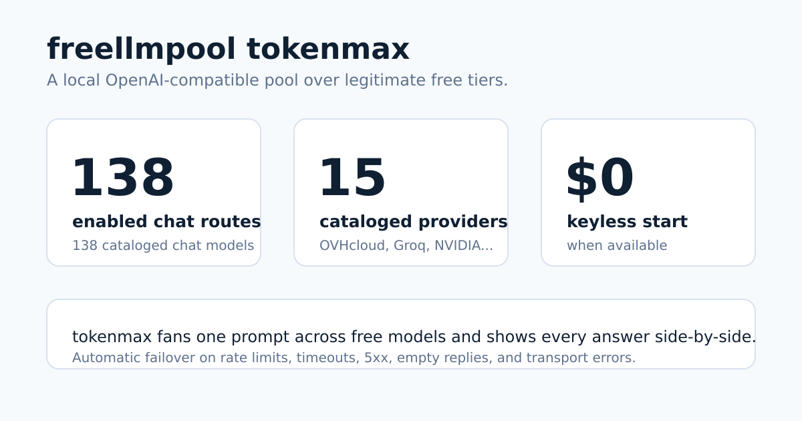

# Archived 0.13 compatibility guide

This is the former README, retained for historical API/plugin instructions and dated comparisons. Its fixed catalog counts, keyless quickstart timing, paid/trial eligibility, advisory quotas, and release assertions do not describe the maintained gateway rewrite. The maintained registry currently admits chat only; historical embedding/transcription examples do not establish supported free routes. Start with the [current setup](../README.md).

# freellmpool

<!-- mcp-name: io.github.0xzr/freellmpool -->





freellmpool catalogs 15 LLM providers as distinct groups spanning recurring
free tiers, keyless endpoints, finite trials, pin-only routes, and disabled
candidates. It exposes 140 enabled chat routes and 140 cataloged chat models,
and automatically pools only
enabled routes you can access behind one OpenAI-compatible endpoint — as a CLI,
a Python library, or a local proxy. It can start without credentials when an
enabled keyless route is available.

[](https://pypi.org/project/freellmpool/)
[](https://github.com/0xzr/freellmpool/actions/workflows/ci.yml)
[](../LICENSE)
[](https://0xzr.github.io/freellmpool/)

[FAQ](../FAQ.md): where prompts go, ToS posture, failover, bans, and comparisons.

## Release and distribution status

- **Latest release: 0.13.0.** The GitHub release and PyPI package are both
  0.13.0; `pip install freellmpool` and `uvx freellmpool` install the audited
  provider catalog, bounded streaming and sentinel hardening, Hermes profile,
  proxy readiness/provider APIs, `spread` routing, and OpenCode
  registry-readiness hardening.

- **Registry publication status: pending.** `opencode-freellmpool` and
  `opencode-freellmpool-tui` are tested but not published on npm as of
  2026-08-29. Use their repository-local installation instructions for now.

## 30-second quickstart

Fresh install to first free-model reply is measured at about 19 seconds under
the 30-second target on a clean Linux/Python 3.12 environment, with no API keys
when a keyless provider is up:

```bash
# One command when uv is installed; no checkout or manually managed virtualenv:
uvx freellmpool ask --max-tokens 32 "Reply with one short sentence: freellmpool is ready."
```

Portable virtual-environment path:

```bash
python3 -m venv .venv
. .venv/bin/activate
python -m pip install --upgrade pip
python -m pip install freellmpool
freellmpool ask --max-tokens 32 "Reply with one short sentence: freellmpool is ready."
```

CI runs the same path from this checkout with
`FREELLMPOOL_QUICKSTART_PACKAGE=. scripts/quickstart-test.sh`.

The catalog covers provider-operated free tiers, keyless routes, and a few
explicit finite-trial or disabled candidates. Eligibility and limits differ by
provider. freellmpool automatically uses only enabled routes you can access,
fails over when one is rate limited or down, and tracks local per-day usage.

Several providers (OVHcloud and Kilo Gateway) need no API key,
and LLM7 works without one, so the quickstart can answer without signup when a
keyless provider is available.

To inspect your local provider keys, agent CLIs, proxy config, and Tailscale
state before wiring tools, run the print-only init wizard:

```bash
freellmpool init --yes
freellmpool init --yes --agent opencode
freellmpool init --yes --agent metaswarm --tailnet
```

Add keys for the other providers to unlock more models and higher limits.

### Local runtimes (explicit, pin-only)

LM Studio, Ollama, and llama.cpp can be previewed from a fixed list of literal
loopback endpoints without scanning your LAN or processes:

```bash
freellmpool local discover
freellmpool local discover --name lm_studio
freellmpool local import --name lm_studio --yes
freellmpool ask --providers local_lm_studio --model "<model-from-discover>" "hello"
```

Discovery is read-only. Import is a separate affirmative step, writes no
credential, and keeps every imported model out of automatic routing
(`auto = false`). `freellmpool local remove local_lm_studio --yes` reverses only
the block managed by the importer. Custom endpoints must be canonical literal
loopback URLs such as `http://127.0.0.1:1234/v1`; hostnames, LAN addresses,
redirects, and broad network scans are rejected.

## First-run setup with `freellmpool init`

`freellmpool init` inspects provider keys, installed agent CLIs, Tailscale
state, and proxy config, then prints one copy-pastable next step without editing
files. Run it detect-only first:

```bash
freellmpool init --yes
```

`--json` emits the same detection as versioned JSON for scripts and agents.

### Tailnet / remote agent gateway

Serve the proxy on your Tailscale 100.x address with a generated API key:

```bash
freellmpool tailnet serve --port 8080
```

From a remote machine:

```bash
freellmpool tailnet connect <tailnet-ip> --port 8080
```

Both sides support `--api-key <shared-secret>` if you want to pin a key instead
of using a generated token. Tailnet serving requires auth by default; do not
run unauthenticated over non-loopback interfaces.

### Metaswarm agent lanes

This project uses one Umans/Kimi K2.7 worker lane, one MiniMax M3 lane, Codex as
escalation, and Claude Opus only for final pre-ship review. The installable
Metaswarm profile mirrors that posture: one free/cheap worker lane through the
local proxy, one larger freellmpool reviewer lane, and Codex/Opus as explicit
user-owned paid escalation/final-review lanes only (never silent).

```bash
freellmpool init --yes --agent metaswarm --tailnet
freellmpool profile install metaswarm
freellmpool tailnet serve --port 8080
freellmpool profile doctor metaswarm --dry-run
```

## Run a coding agent on free models

freellmpool's proxy speaks the OpenAI API and includes an experimental
Anthropic-compatible path, so coding agents can run against pooled free tiers —
just point them at the proxy:

```bash
freellmpool proxy                       # starts http://localhost:8080
freellmpool code claude                 # prints the one-line setup for Claude Code
freellmpool profile list                # richer installable profiles
freellmpool profile show metaswarm      # Tailnet-aware Metaswarm profile
freellmpool profile install hermes       # Hermes custom-endpoint config
# (also: codex, aider, cline, continue, cursor, hermes, opencode, metaswarm)
```

The Hermes profile prints (and never writes) this supported custom-endpoint
block; `hermes model` provides the interactive equivalent:

```yaml
model:
  provider: custom
  default: quality
  base_url: http://localhost:8080/v1
  api_key: anything
```

Claude Code gateway mode can also be launched directly:

```bash
ANTHROPIC_BASE_URL=http://localhost:8080 \
ANTHROPIC_AUTH_TOKEN=dummy \
ANTHROPIC_API_KEY=dummy \
ANTHROPIC_MODEL=auto \
ANTHROPIC_SMALL_FAST_MODEL=auto \
CLAUDE_CODE_ENABLE_GATEWAY_MODEL_DISCOVERY=1 \
claude
```

Existing OpenAI-compatible apps work the same way: set
`OPENAI_BASE_URL=http://localhost:8080/v1` and keep your code unchanged.
Anthropic-compatible tools can use the experimental bridge with
`ANTHROPIC_BASE_URL=http://localhost:8080`.

Text-only `/v1/responses` and `/v1/messages` requests stream incrementally from
the selected provider. Tool calls and richer content intentionally stay on the
buffered compatibility path. The browser dashboard and playground share one
public, data-free shell; when proxy auth is enabled it prompts for the bearer
token and keeps it only in page memory while protected status, inventory,
model, and battle calls continue to require the `Authorization` header.

**OpenCode** gets a deeper integration in 0.12.0: a live in-editor **dashboard** (routing mode,
estimated savings, tokens served free, provider race, latency), per-request
**agent routing** via the model picker (`freellmpool/agent|spread|auto|fast|quality|fair`), and `freellmpool_status`
/ `freellmpool_models` tools — see [integrations/opencode-tui](../integrations/opencode-tui)
and the [guide](https://0xzr.github.io/freellmpool/run-opencode-on-free-models.html).
The plugin registers its routing aliases automatically on supported OpenCode
versions without rewriting user configuration. Restart OpenCode and check
`opencode models freellmpool`.
The package tarballs are validated in CI, but npm publication remains pending;
the linked local-file instructions remain the working install path.

**New in 0.11:** capacity tools — `freellmpool capacity status` shows which free
tiers are usable right now, `freellmpool providers health` live-probes them, and
`freellmpool keys add` walks you through configuring more (see
[Capacity & provider health](#capacity--provider-health) and
[docs/CAPACITY.md](../docs/CAPACITY.md)).

**New in 0.10:** an async API (`AsyncPool`), an MCP server (`freellmpool mcp`),
latency-aware routing with `freellmpool benchmark`, observability hooks, and a
plugin system for custom providers. See the [changelog](../CHANGELOG.md).

## Install

```bash
pip install freellmpool      # or: pipx install freellmpool
```

Only dependency is `httpx`. Python 3.11+.

### Docker and Open WebUI

The published container runs the local proxy as an unprivileged user. Persist
quota, stats, route-health, cache, and configuration state in a named volume:

```bash
docker volume create freellmpool-data
docker run --rm -p 127.0.0.1:8080:8080 \
  --volume freellmpool-data:/home/freellmpool/.config/freellmpool \
  --env GROQ_API_KEY \
  ghcr.io/0xzr/freellmpool:0.13.0
```

Omit `--env GROQ_API_KEY` if you want a credential-free start; the proxy can
answer only while an enabled keyless route is available. Keep the published
port on loopback. If you deliberately expose it, set
`FREELLMPOOL_PROXY_KEY` and require that Bearer token from clients.

For the bundled Open WebUI stack, place any provider credentials in `.env` and
run `docker compose up -d`. Compose waits for the proxy health check and keeps
both freellmpool and Open WebUI state in named volumes; open
`http://localhost:3000` after both services are healthy.

## Command line

```bash
freellmpool ask "Write a haiku about sqlite"
git diff | freellmpool ask "Write a commit message for this"
freellmpool tokenmax "Hardest question you've got"  # 🌈 blast models, print answers, optional synthesis
freellmpool providers        # which providers are configured
freellmpool models           # cataloged provider/model ids
freellmpool stats            # lifetime tokens served free + estimated cost avoided
freellmpool badge -o badge.svg   # a shareable SVG badge of that total
freellmpool badge --summary -o summary.svg   # a larger usage summary card
```

`freellmpool tokenmax` is the tongue-in-cheek maximum-effort mode: it fans your
prompt out to many available models at once and prints each answer. The CLI adds
a synthesized verdict by default unless you pass `--no-synthesize`; the MCP tool
returns the model answers for the calling agent to synthesize. (See
[docs/MCP.md](../docs/MCP.md).)

`freellmpool stats` is a running, **persistent** lifetime total (it survives restarts
and upgrades). Embed `freellmpool badge` in a README, or use
`freellmpool badge --summary -o summary.svg` for a larger card with tokens,
requests, estimated savings, and provider mix. The proxy can serve both
`/badge.svg` and `/summary.svg` live when `FREELLMPOOL_PUBLIC_BADGE=1` makes
public badges embeddable.

Pin a provider or model; common OpenAI/Anthropic model names are mapped to a free
equivalent so existing scripts keep working:

```bash
freellmpool ask -m groq/openai/gpt-oss-20b "hi"
freellmpool ask -p cerebras,groq "hi"
freellmpool ask -m gpt-4o-mini "hi"      # routed to a free model
```

### Roles

`freellmpool roles` lists ask-role presets (`coder`, `critic`, `summarizer`,
`grounded-reader`, `long-context`, `cheap`, `fast`, `second-opinion`, ...). Each
role sets routing, token budget, temperature, task intent, and system-prompt hints
without inventing a second routing engine. Explicit flags (`--model`, `--providers`,
`--routing`, `--task`, `--max-tokens`) win over role defaults.

```bash
freellmpool ask --role coder "write a pytest for this function"
freellmpool ask --role grounded-reader "read this Markdown file"
freellmpool ask --routing quality --task general "ignore automatic task classification"
FREELLMPOOL_MODE=wise freellmpool ask --role cheap "summarize this patch"
```

## As a proxy

Run a local server that speaks the OpenAI API, then point any OpenAI-compatible
tool at it. On loopback, any placeholder API key works unless you configured
`FREELLMPOOL_PROXY_KEY` or passed `--api-key`; Tailnet/LAN serving requires a
real proxy bearer token by default.

```bash
freellmpool proxy
export OPENAI_BASE_URL=http://localhost:8080/v1
export OPENAI_API_KEY=unused
```

```python
from openai import OpenAI
client = OpenAI()
print(client.chat.completions.create(
    model="auto",
    messages=[{"role": "user", "content": "hi"}],
).choices[0].message.content)

# audio → text (Whisper), same client:
print(client.audio.transcriptions.create(
    model="auto", file=open("audio.mp3", "rb"),
).text)
```

Or with `curl` (multipart upload):

```bash
curl -s http://localhost:8080/v1/audio/transcriptions \
  -F file=@audio.mp3 -F model=auto
```

The proxy also implements the OpenAI Responses API (for the Codex CLI) and an
experimental Anthropic Messages API path (for Claude Code), so coding agents can
run on free models too. `freellmpool code <agent>` prints the exact setup, while
`freellmpool profile install <agent>` prints the fuller copy-pastable profile
without mutating third-party config:

```bash
freellmpool code aider       # also: claude, codex, cline, continue, cursor, hermes, opencode
freellmpool profile show opencode
freellmpool profile doctor opencode --dry-run
```

Release 0.12.0 proxy surfaces:

- `/v1/chat/completions` — OpenAI-compatible chat, token streaming, tool calling.
- `/v1/responses` — Responses API shim with incremental text streaming; tools
  and rich content use the buffered compatibility path.
- `/v1/messages` — experimental Anthropic-compatible Messages path with the
  same incremental-text / buffered-tool split.
- `/v1/embeddings` and `/v1/audio/transcriptions` — OpenAI-compatible embedding
  and Whisper-style multipart transcription.
- `/v1/models` — routing aliases plus concrete `provider/model` ids.
- `/v1/models?ready=true` — the same shape, limited to locally ready targets.
- `/v1/providers` — authenticated, secret-free provider/model readiness details.
- `/freellmpool/battle` and `/playground` — bounded browser/JSON model comparisons.
- `/healthz` and `/livez` — public process liveness aliases.
- `/readyz` — public advisory local-capacity readiness (200 when at least one
  provider is ready, otherwise 503); it never live-probes an upstream.
- `/dashboard`, `/status`, `/badge.svg`, and `/summary.svg` — local operations surfaces.

`/`, `/dashboard`, and `/playground` serve one public, data-free shell. When a
proxy key is set, the shell prompts for it and keeps it only in page memory;
status, provider/model inventory, battle, and model API calls remain header-auth
protected. Liveness/readiness stay public for orchestrator probes; readiness is
a local quota/cooldown snapshot, not an upstream health guarantee.
Setup snippets for specific tools are in [docs/INTEGRATIONS.md](../docs/INTEGRATIONS.md)
and [docs/AGENTS.md](../docs/AGENTS.md). The repo also includes an experimental
[metaswarm review adapter](../integrations/metaswarm) for using `freellmpool` as an
external-tools reviewer/second opinion. `freellmpool profile show metaswarm`
documents a free/cheap worker lane, a larger reviewer lane, Tailnet client setup,
and paid Codex/Opus lanes as explicit user-owned escalation paths only.

## As a library

```python
from freellmpool import Pool

pool = Pool.from_default_config()
reply = pool.ask("Summarize the plot of Hamlet in 20 words.")
print(reply.text, "—", reply.provider_id)

vectors = pool.embed(["first document", "second document"]).vectors

with open("audio.mp3", "rb") as f:
    text = pool.transcribe(f.read(), "audio.mp3").text   # Whisper, failover across providers
```

Async is the same API with `await`:

```python
from freellmpool import AsyncPool

async with AsyncPool.from_default_config() as pool:
    reply = await pool.aask("Summarize the plot of Hamlet in 20 words.")
```

Pass `on_event=...` to either pool to receive structured routing/cache events
(`attempt`/`success`/`error`/`cooldown`/`cache_hit`/`cache_miss`/`exhausted`) for logging or tracing. Add
your own endpoint with `register_provider(...)`, or a new request shape with
`register_adapter(name, fn)`.

## Benchmark your providers

`freellmpool benchmark` times one call per configured provider and prints
latency and success, so you can see which of your free tiers are fastest right
now. The router learns the same latency/success signal from real traffic as it
runs; set `FREELLMPOOL_ROUTING=fast` to prefer the lowest-latency provider
instead of the default least-used-first.

```
$ freellmpool benchmark
  provider/model            status   latency  note
  cerebras/gpt-oss-120b     ok        180 ms  6 tok
  groq/openai/gpt-oss-20b   ok        240 ms  6 tok
  ovh/Meta-Llama-3_3-70B-Instruct  FAIL    -  HTTP 429
```

## Capacity & provider health

Free tiers drift through the day — keys expire, providers go down, daily caps
fill. These commands tell you what's usable right now and what to set up next:

```bash
freellmpool capacity status --target 5   # who's healthy / near quota / missing a key
freellmpool capacity status --refresh    # explicitly refresh advisory provider metadata
freellmpool quota-wise status            # local headroom + recommended mode
freellmpool providers health             # send one tiny request to each, time it
freellmpool keys checklist --target 5    # which keys to add to reach N healthy providers
freellmpool keys add groq                # configure a key (and record metadata)
```

Protocol support is verified separately from basic provider health. Run
`freellmpool conformance run` to check chat, streaming, tools, JSON object/schema,
vision, Responses, and Anthropic Messages with bounded synthetic requests, then inspect
the sanitized evidence with `freellmpool conformance status --json`.
Feature-specific auto-routing uses only verified targets; an exact
provider/model pin is the explicit override. Full operator and privacy contract:
[docs/PROTOCOL_CONFORMANCE.md](../docs/PROTOCOL_CONFORMANCE.md).

`capacity status` is offline and cache-first: it reads your catalog, environment, and
per-day quota counters and labels each provider `healthy`, `low_quota`,
`exhausted`, `invalid_key`, or `missing`. Cached metadata from the advisory
external catalog ([mnfst/awesome-free-llm-apis](https://github.com/mnfst/awesome-free-llm-apis))
can suggest free providers you could add; only an explicit
`freellmpool capacity status --refresh` or `freellmpool catalog sync` uses the
network for that metadata. It remains advisory only; your `providers.toml`
stays the source of truth for routing. `keys add <name>` can import a
suggested provider from that catalog or create an OpenAI-compatible stub and
autodiscover its models. The proxy `/dashboard` shows the same capacity at a
glance. Full reference: [docs/CAPACITY.md](../docs/CAPACITY.md).

`FREELLMPOOL_MODE=wise` is the conservative quota mode: `ask` defaults to a
smaller output budget and spread routing, `tokenmax` narrows its default fan-out,
and broad multi-model calls require confirmation unless you pass `--yes`.
Per-command `--mode normal|wise` overrides the environment, and
`[settings] mode = "wise"` works from `config.toml`. The `conserve` role is a
quota-conscious shorthand for small, spread-routed answers.

For a bounded second opinion instead of a full `tokenmax` blast:

```bash
freellmpool ask --second-opinion --opinions 3 "is this implementation plan sound?"
freellmpool ask --role second-opinion --synthesize "which release note is clearer?"
```

The shared panel asks a few diverse providers, keeps individual failures visible,
and can append a non-fatal synthesis when you pass `--synthesize`.

For a side-by-side comparison you can inspect in the terminal or local browser:

```bash
freellmpool battle "which changelog entry is clearer?" --synthesize
freellmpool proxy --port 8080
freellmpool playground --port 8080
```

Bundled recipes wrap common workflows in JSON files you can inspect and run:

```bash
freellmpool recipe list
freellmpool recipe run second-opinion "is this launch plan clear?" --synthesize
freellmpool recipe run pr-review --input patch.diff
freellmpool recipe run repo-summary --path 'src/freellmpool/*.py'
freellmpool recipe run metaswarm-worker-review --input worker.md --validation-output-file validation.txt
```

Recipes use the same role presets and shared panel helper as `ask` and `battle`;
there is no separate routing engine.

### Local foreground job queue

For slow, quota-aware work that should not block a live session, queue jobs to
an append-only JSONL log under your config dir (override with
`FREELLMPOOL_JOBS_PATH`). The queue is foreground-only: `jobs run` processes
one job at a time and records started/completed/failed/cancelled events.
Completed ask jobs keep their output in the job log; completed recipe jobs also
write run records and Markdown reports via the same report helpers used by
`freellmpool report`.

```bash
# queue a recipe job
freellmpool jobs add --recipe pr-review --input patch.diff

# queue an ask job with a role preset
freellmpool jobs add --role summarizer "summarize the latest changelog"

freellmpool jobs list            # replayed state (idempotent across restarts)
freellmpool jobs watch           # one-shot refresh render, no daemon

freellmpool jobs run --dry-run   # print execution order, mutate nothing
freellmpool jobs run --max-failures 2   # halt after N consecutive failures
freellmpool jobs cancel <job-id> # append a cancel tombstone, not a mutation

freellmpool report list
freellmpool report last --markdown
freellmpool report last --html --path
freellmpool cost show <run-id>
```

Cancellation is a new tombstone event, not a re-write of the earlier queued
record — a crash before `jobs run` finishes still leaves the queue
replayable, and cancelled jobs stay cancelled after restart. Duplicate
submissions create distinct jobs; pass `--dedupe` to reject re-submission of
the same recipe or role while a job is still pending.

## As an MCP server

`freellmpool mcp` runs a Model Context Protocol server over newline-delimited
JSON-RPC stdio, so Claude Desktop, Claude Code, or Cursor can hand subtasks to
free models. It exposes ask, panel/second-opinion, battle, recipe, roles,
Tailnet-info, quota-wise, route-preview, models, quota, stats, and `tokenmax`
tools. See [docs/MCP.md](../docs/MCP.md). A [`server.json`](../server.json) is included
for the [MCP registry](https://registry.modelcontextprotocol.io/).

## In Simon Willison's `llm` CLI

There's a plugin: `llm install llm-freellmpool` → `llm -m freellmpool "..."`.
It can answer without an API key while an enabled keyless route is available.
Source: [plugins/llm-freellmpool](../plugins/llm-freellmpool).

## Provider keys

freellmpool reads keys from the environment and uses whatever is set. No key is
required while an enabled keyless route is available; credentials expand the
set of accessible routes. Step-by-step signup links, including verification and
payment-method caveats, are in
[docs/ACCOUNTS.md](../docs/ACCOUNTS.md).

| Provider | Env var | Notes |
|---|---|---|
| OVHcloud | — | no key needed (anonymous tier) |
| Kilo Gateway | — | no key needed |
| LLM7 | `LLM7_API_KEY` | optional |
| Groq | `GROQ_API_KEY` | current free-plan routes; exact limits vary by model |
| NVIDIA NIM | `NVIDIA_API_KEY` | |
| OpenRouter | `OPENROUTER_API_KEY` | free models |
| Google Gemini | `GEMINI_API_KEY` | |
| Cloudflare | `CLOUDFLARE_API_TOKEN` + `CLOUDFLARE_ACCOUNT_ID` | |
| OpenCode Zen | — | dynamic free routes require current discovery and policy evidence |
| Aion Labs | `AION_API_KEY` | 20K free tokens/day, no card |
| ModelScope API Inference | `MODELSCOPE_API_KEY` | 2,000 free calls/day |
| Vercel AI Gateway | `AI_GATEWAY_API_KEY` | only the publicly price-verified zero-price Poolside route is retained; current account evidence is required |
| Mistral, Cohere, Z.ai, Ollama Cloud | see `.env.example` | |

A `config.toml` (see [config.toml.example](../config.toml.example)) can hold keys,
model aliases, and settings instead of env vars.

## Local diagnostics and operations

Run `freellmpool doctor` for a no-network local check of package version, config
paths, configured provider count, routing mode, quota/cache locations, external
catalog cache age, and bundled catalog validity.

Response caching is off unless `FREELLMPOOL_CACHE_TTL` (seconds) or
`[settings] cache_ttl` is positive. When enabled, cache rows live in SQLite with
WAL mode and TTL pruning; `FREELLMPOOL_CACHE_MAX_ENTRIES` caps retained rows
(default `10000`, set `0` to disable size pruning).

Quota counters are written immediately by default. Long-running proxy/MCP
processes can reduce file churn with `FREELLMPOOL_QUOTA_FLUSH_EVERY=N`, which
batches up to `N` successful requests before flushing. Shutdown paths and
`quota.snapshot()` flush pending counts, so dashboards and process exits still
see current totals.

Recent per-route health is persisted at
`~/.config/freellmpool/route_health.json` (override with
`FREELLMPOOL_HEALTH_FILE`). The bounded, atomic state contains route names,
timings, counters, and normalized failure classes only—never prompts, responses,
headers, or credentials. `/status` reports circuit state, sample age, and reset
time for each enabled route.

## How routing works

For each request, freellmpool builds the list of `(provider, model)` pairs you
have access to, then orders providers least-used-first and picks a least-used
model inside that provider. This keeps providers with large catalogs, like
NVIDIA, from receiving more traffic only because they expose more models. A
provider that returns a 429 is set aside for its advertised `Retry-After` or
rate-limit reset window. Repeated availability failures open a per-route circuit;
after cooldown, one half-open probe can restore the route. Daily counts are kept
in `~/.config/freellmpool/quota.json` and reset at UTC midnight.

Every call records latency and success per model target. A provider whose targets
are currently failing sinks to the back automatically; with
`FREELLMPOOL_ROUTING=fast` the fastest measured provider goes first instead.
`FREELLMPOOL_ROUTING=fair` spreads requests across providers to preserve daily
quota. `freellmpool benchmark` warms these metrics on demand. To restore the old
per-model balancing behavior, set `FREELLMPOOL_ROUTING=legacy` or
`FREELLMPOOL_ROUTING=model` (or `FREELLMPOOL_ROUTING=model-fast` for the old
per-model fastest-first ordering).

**Quality routing (`FREELLMPOOL_ROUTING=quality`).** Free tiers' strongest models
have the smallest daily caps, so a naive pool gets weaker as the day fills. Quality
routing matches each prompt's *difficulty* to each model's *capability*: hard
prompts (long input, code, reasoning cues) go to the strongest available model, and
easy ones go to lightweight models — which rations scarce strong-model quota so the
pool stays sharp for longer. It also recognizes high-confidence grounded Markdown
reading/extraction requests locally. When repeated evidence from the versioned,
sanitized fixture exists for a candidate's exact model identity, a bounded task-fit
term influences quality ordering. Unmeasured models remain reachable, and if no
candidate has current evidence the ordering is unchanged. Capability is grounded in
real benchmark data, not guessed from names; models that no benchmark lists cover
fall back to a name heuristic.

Use `--task grounded-reading` to declare that intent, `--task general` to suppress
automatic classification, or `--task auto` to classify locally. OpenAI-compatible,
Responses, and Anthropic proxy clients can send the body extension
`"task": "grounded-reading"` or the `X-Freellmpool-Task` header. Explicit intent
wins over automatic classification. Task evidence stores aggregate pass counts,
fixture hashes, and scores only—never prompts, documents, responses, or provider
secrets.

The bundled, offline scores come from [LMArena](https://lmarena.ai/) Elo (an
MIT-licensed snapshot) and the [Aider](https://aider.chat/) code-editing
leaderboard (Apache-2.0), normalized to a common percentile scale. For much
broader coverage, run `freellmpool capability sync` with a free
[Artificial Analysis](https://artificialanalysis.ai/) API key
(`FREELLMPOOL_AA_API_KEY`) — its Intelligence Index covers most current and
open-weight models and takes precedence. The fetched AA data is cached locally
under your own key (never bundled, per AA's terms). `freellmpool capability
status` shows current coverage. Scores via LMArena and Aider; intelligence index
via Artificial Analysis when keyed.

**Context windows.** Free models often have small context windows. freellmpool
never truncates your input; instead, when a model rejects a request as too long,
it learns that model's limit and stops routing oversized requests there, escalating
only to larger-window models. If nothing fits it raises a clear
`ContextWindowExceeded` (with the estimated input size) instead of a generic
failure — over the proxy that's a `413`. You can declare a model's window with
`context = N` in `providers.toml` to skip it proactively.

Architecture notes: [docs/ARCHITECTURE.md](../docs/ARCHITECTURE.md).

## Limitations

- Free-tier models are smaller than frontier models. They're good for drafting,
  summarizing, classification, triage, and everyday coding — not a replacement
  for GPT-class reasoning on hard problems.
- Quality and capacity vary through the day as high-cap tiers exhaust.
  freellmpool's local per-day counters reset at UTC midnight; upstream
  providers use their own limit and reset windows.
- Free tiers change without notice. When a model id or limit goes stale, a
  one-line PR to `providers.toml` fixes it for everyone.
- The proxy is meant for local/single-user use. It binds to `127.0.0.1` by
  default; if you expose it, set a key (`--api-key`).
- The Claude Code / Anthropic path is experimental (text and tool use; no vision).
- These are free tiers shared by everyone — don't abuse them.
- Upstream providers receive and may prompt-title/moderate your requests; use
  the FAQ privacy table and each provider's current terms before sending
  sensitive prompts.
- Free-tier availability, model IDs, and rate limits drift without notice.
  freellmpool does not bypass provider limits, rotate accounts, or evade
  quotas.

## How it compares

Comparison snapshot: 2026-07-19. Competitor rows link to the exact README commit
used for the claims; scopes change quickly, so treat this as a dated map rather
than a permanent ranking.

| Tool | Keyless start | # providers | Failover | MCP server | CLI | Transcription | Local/self-hosted | License |
|---|---|---:|---|---|---|---|---|---|
| **freellmpool** | Yes, when a configured keyless provider is available | 22 chat providers cataloged locally | Yes: retryable provider failures, empty replies, and transport errors | Yes: `freellmpool mcp` | One-shot CLI plus profiles, library, and proxy commands | Yes: `/v1/audio/transcriptions` with failover | Yes: small Python package and local proxy | MIT |
| [OpenRouter free models](https://openrouter.ai/openrouter/free/providers) | No: hosted API use requires an account/key | Hosted router; the linked free router listed 22 models at snapshot | [Yes](https://openrouter.ai/docs/guides/routing/model-fallbacks): hosted provider/model fallbacks | [Yes](https://openrouter.ai/blog/announcements/openrouter-mcp-server/): hosted remote MCP server | Hosted API/SDK and agent SDK, not a local gateway CLI | [Audio input/transcription](https://openrouter.ai/docs/guides/overview/multimodal/audio) through multimodal chat | No: hosted service | Proprietary service |
| [LiteLLM](https://github.com/BerriAI/litellm/blob/5d4c4d0fce45c73c4b56b48e46dfc4e56e8b0aa5/README.md) | No: bring provider or hosted-gateway credentials | README claims 100+ LLMs/providers | Yes: router retries/fallbacks | Yes: AI Gateway includes an MCP Gateway | Python SDK and proxy/gateway CLI surface | Yes: `/audio/transcriptions` | Yes: self-hosted proxy or hosted offering | MIT core; commercial enterprise features |
| [OmniRoute](https://github.com/diegosouzapw/OmniRoute/blob/d8ff51874c8add566d43225988b9bc67e0542d65/README.md) | Yes: its setup documents a no-auth OpenCode option | README claims 268 integrations/providers and 90+ free options | Yes: layered fallback/circuit-breaker routing | Yes: MCP and A2A control planes | Broad management CLI and one-command agent setup | Audio translation is documented; other media capabilities vary by provider | Yes: Node application with dashboard, Docker, desktop/PWA paths | MIT |
| [FreeLLMAPI](https://github.com/tashfeenahmed/freellmapi/blob/759de8e7ed1edc1cd513c9777cd0a807fb5ceee3/README.md) | Server starts with a Docker one-liner; inference capacity is configured afterward | README claims **28 free LLM providers** and 339 endpoints | Yes: provider/key routing and fallback | Yes: **MCP (Streamable HTTP)** | Dashboard/server and desktop apps | Not documented; audio speech/TTS is supported | Yes: Node/Docker server and desktop apps | MIT |

FreeLLMAPI predates this project, and the overlap is independent convergence
around legitimate free tiers. OmniRoute
optimizes for an expansive control plane and many protocols; FreeLLMAPI for a
dashboard-centric self-hosted router with encrypted key management; freellmpool
for the smallest Python/CLI/library path with a keyless-capable first reply.
Those are product-scope choices, not a claim that one tool is best for every
deployment.

## FAQ

**Is there a free, OpenAI-compatible LLM API gateway?** Yes — freellmpool is a
free, MIT-licensed gateway that exposes one OpenAI-compatible endpoint over the
enabled routes you can access. Its 15 cataloged provider groups span recurring
free tiers, keyless endpoints, finite trials, pin-only routes, and disabled
candidates. `pip install freellmpool` and point any OpenAI client at the local
proxy.

**How do I use multiple free LLM APIs at once?** freellmpool pools them: each request
goes to a provider you have access to, fails over to the next when one is rate-limited
or down, and tracks per-day usage so load spreads across tiers.

**Can I run Claude Code or Codex on free models?** Yes — the proxy speaks the
OpenAI API and has an experimental Anthropic-compatible path. Set
`OPENAI_BASE_URL=http://localhost:8080/v1` for OpenAI-compatible tools or
`ANTHROPIC_BASE_URL=http://localhost:8080` for Anthropic-compatible tools, then
run Codex, Claude Code, aider, Cline, Continue, or Cursor against pooled free tiers. For Claude Code, set
`CLAUDE_CODE_ENABLE_GATEWAY_MODEL_DISCOVERY=1` so `/v1/models` is discovered
through the Anthropic bridge. See `freellmpool code <agent>`. (Claude Code path is
experimental: text + tools, no vision.)

**Do I need an API key?** Not while an enabled keyless route is available:
OVHcloud and Kilo Gateway expose keyless routes, and LLM7 is
key-optional. Add applicable free-tier or trial credentials for more routes and
capacity; availability and terms remain provider-specific.

**Is it free and open source?** Yes, MIT-licensed. More at the
[project page](https://0xzr.github.io/freellmpool/).

## Featured in

- Community videos (Spanish, by lytohlg AI): ["Accede a 18 modelos de IA GRATIS con 1 solo comando"](https://www.youtube.com/watch?v=1UfIlWoedho) and ["Prueba 18 IAs GRATIS sin API key en 30 segundos"](https://www.youtube.com/watch?v=oaM_E92WVGQ) (from an earlier catalog; freellmpool now catalogs 15 providers).
- Directory: [FreeLLM Pool on MCP Market](https://mcpmarket.com/server/freellm-pool).

## Contributing

New providers and fixes to stale limits are the most useful contributions, and
both are usually a small change to `providers.toml`. See
[CONTRIBUTING.md](../CONTRIBUTING.md). Maintainer-ready newcomer tasks are drafted in
[docs/GOOD_FIRST_ISSUES.md](../docs/GOOD_FIRST_ISSUES.md). Tests run with no network access:

```bash
python -m pip install -e ".[dev]" && ruff check . && pytest
```

Source-first verification in this repo uses `PYTHONPATH=src` so `pytest` exercises
the checkout without requiring an editable install first; CI runs the same
configuration. Release readiness uses `PYTHONPATH=src python3 scripts/check_release_ready.py`.
Security scanners, severity gates, the expiring exception process, local
reproduction, SBOMs, and provenance verification are documented in
[SECURITY.md](../SECURITY.md).

## License

MIT
